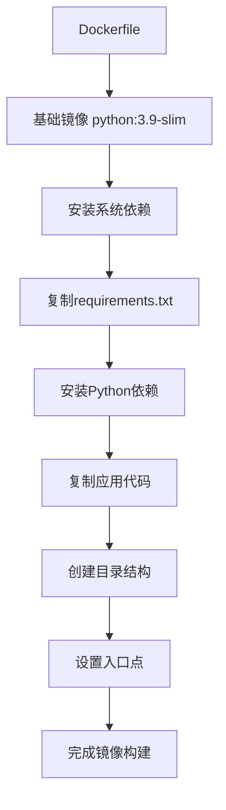
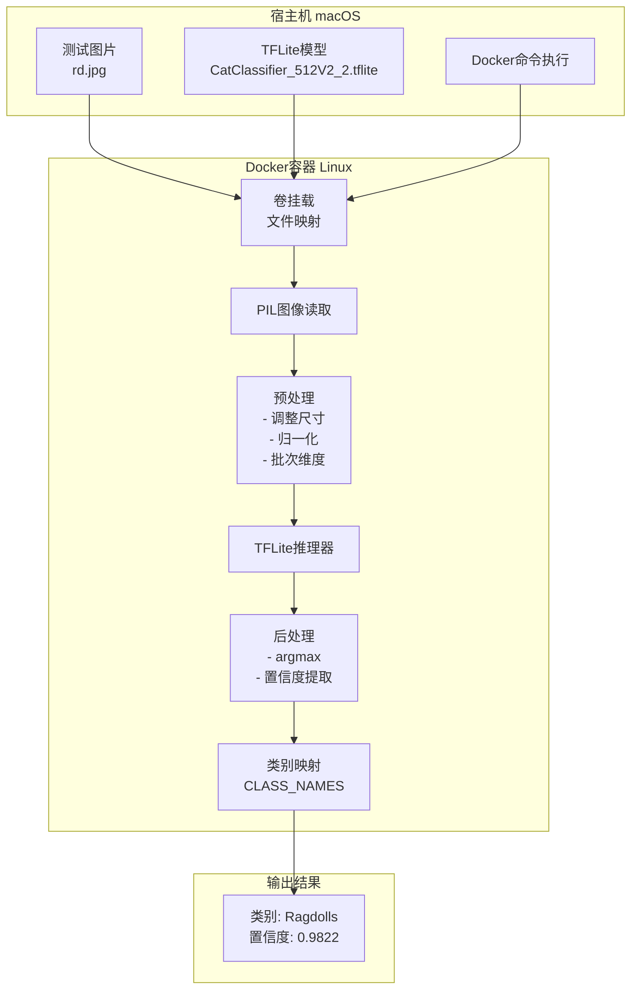

# 🐱 猫类别识别Docker系统原理详解

## 📋 目录
1. [Docker容器化原理](#docker容器化原理)
2. [图片传递机制](#图片传递机制)
3. [TensorFlow Lite推理流程](#tensorflow-lite推理流程)
4. [数据流向图](#数据流向图)
5. [技术栈分析](#技术栈分析)

## 🐳 Docker容器化原理

### 1. 容器构建过程


### 2. 分层构建优势
- **基础镜像层**: Python 3.9运行环境
- **系统依赖层**: OpenCV、图像处理库
- **Python依赖层**: NumPy、Pillow、TFLite
- **应用代码层**: 我们的推理脚本
- **配置层**: 目录结构和入口点

### 3. 系统依赖解析
```bash
# 图像处理相关
libgl1-mesa-glx     # OpenGL支持
libglib2.0-0        # GLib库
libsm6              # X11会话管理
libxext6            # X11扩展
libxrender-dev      # X11渲染

# 数学计算相关
libgomp1            # OpenMP多线程支持
```

## 📁 图片传递机制

### 1. 卷挂载(Volume Mount)原理
```bash
# 命令结构解析
docker run --rm \
    -v "$(pwd)":/app/models \              # 宿主机当前目录 → 容器/app/models
    -v "$(pwd)/../data/test":/app/test_images \  # 宿主机测试图片 → 容器/app/test_images
    cat-classifier \                        # 镜像名称
    --model /app/models/model.tflite \     # 容器内模型路径
    --image /app/test_images/cat.jpg       # 容器内图片路径
```

### 2. 文件路径映射
```
宿主机Mac系统                     Docker容器Linux系统
├── /Users/ding/Desktop/NUS-proj/lite/
│   ├── CatClassifier_512V2_2.tflite  →  /app/models/CatClassifier_512V2_2.tflite
│   └── lite_client.py                 →  /app/lite_client.py
└── /Users/ding/Desktop/NUS-proj/data/test/
    ├── rd.jpg                         →  /app/test_images/rd.jpg
    ├── sing.jpg                       →  /app/test_images/sing.jpg
    └── sp.jpg                         →  /app/test_images/sp.jpg
```

### 3. 数据流向分析


## 🧠 TensorFlow Lite推理流程

### 1. 模型加载过程
```python
# 1. 加载TFLite模型
interpreter = tflite.Interpreter(model_path=model_path)
interpreter.allocate_tensors()

# 2. 获取输入输出张量信息
input_details = interpreter.get_input_details()
output_details = interpreter.get_output_details()
```

### 2. 图像预处理流程
```python
# 步骤1: 读取图像
image = Image.open(image_path).convert('RGB')

# 步骤2: 调整尺寸 (通常是224x224或512x512)
image = image.resize((input_shape[1], input_shape[2]))

# 步骤3: 转换为NumPy数组
image_array = np.array(image, dtype=np.float32)

# 步骤4: 归一化 [0,255] → [0,1]
image_array = image_array / 255.0

# 步骤5: 添加批次维度 (1, H, W, C)
image_array = np.expand_dims(image_array, axis=0)
```

### 3. 推理执行流程
```python
# 1. 设置输入数据
interpreter.set_tensor(input_details[0]['index'], image_array)

# 2. 执行推理
interpreter.invoke()

# 3. 获取输出结果
output_data = interpreter.get_tensor(output_details[0]['index'])
predictions = output_data[0]  # 形状: [num_classes]

# 4. 解析结果
predicted_class = np.argmax(predictions)      # 最高概率的类别索引
confidence = predictions[predicted_class]     # 对应的置信度
```

## 📊 数据流向图



## 🔧 技术栈分析

### 1. 核心组件
| 组件 | 版本 | 作用 |
|------|------|------|
| **Docker** | Latest | 容器化运行环境 |
| **Python** | 3.9 | 主要编程语言 |
| **TensorFlow Lite** | ≥2.13.0 | 轻量级推理引擎 |
| **NumPy** | <2.0 | 数值计算(兼容性) |
| **Pillow** | ≥9.5.0 | 图像处理 |

### 2. 模型特点
- **模型格式**: TensorFlow Lite (.tflite)
- **模型大小**: ~11MB (CatClassifier_512V2_2.tflite)
- **输入尺寸**: 可能是512x512或224x224
- **输出类别**: 5个猫的品种
- **优化**: 量化优化，适合移动端部署

### 3. 性能优化
```python
# XNNPACK加速
INFO: Created TensorFlow Lite XNNPACK delegate for CPU.
```
- 使用XNNPACK委托进行CPU加速
- 支持ARM64架构(Mac M1/M2)
- 内存高效的推理执行

## 🎯 关键优势

### 1. 跨平台兼容性
- **开发环境**: macOS
- **部署环境**: Linux容器
- **无环境冲突**: 隔离的运行环境

### 2. 轻量级部署
- **小模型**: TFLite格式
- **快速启动**: 容器化部署
- **资源高效**: CPU推理优化

### 3. 易于扩展
- **批量处理**: 可以处理多张图片
- **模型更新**: 只需替换.tflite文件
- **参数调整**: 通过命令行参数控制

## 🚀 实际应用场景

1. **边缘设备部署**: 在树莓派、移动设备上运行
2. **批量图像处理**: 处理大量猫咪图片分类
3. **API服务**: 包装为REST API提供在线服务
4. **实时应用**: 结合摄像头进行实时识别

这个系统展示了现代机器学习应用的最佳实践：模型轻量化、容器化部署、跨平台兼容。
